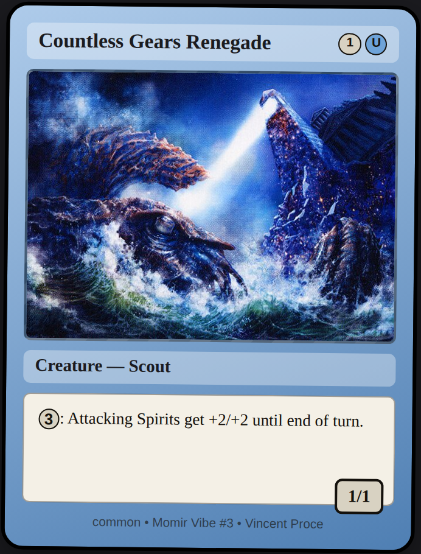
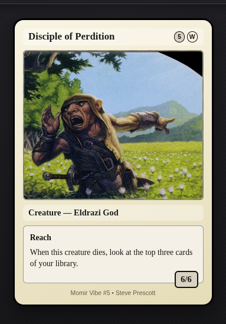
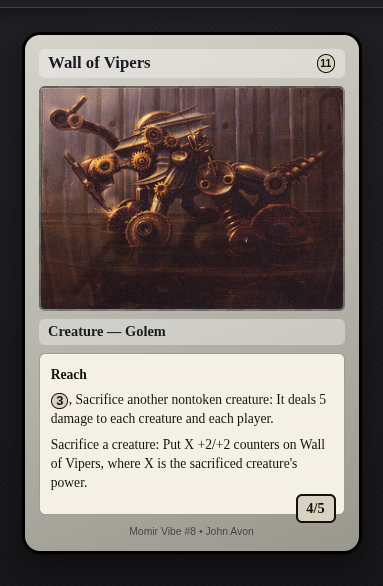
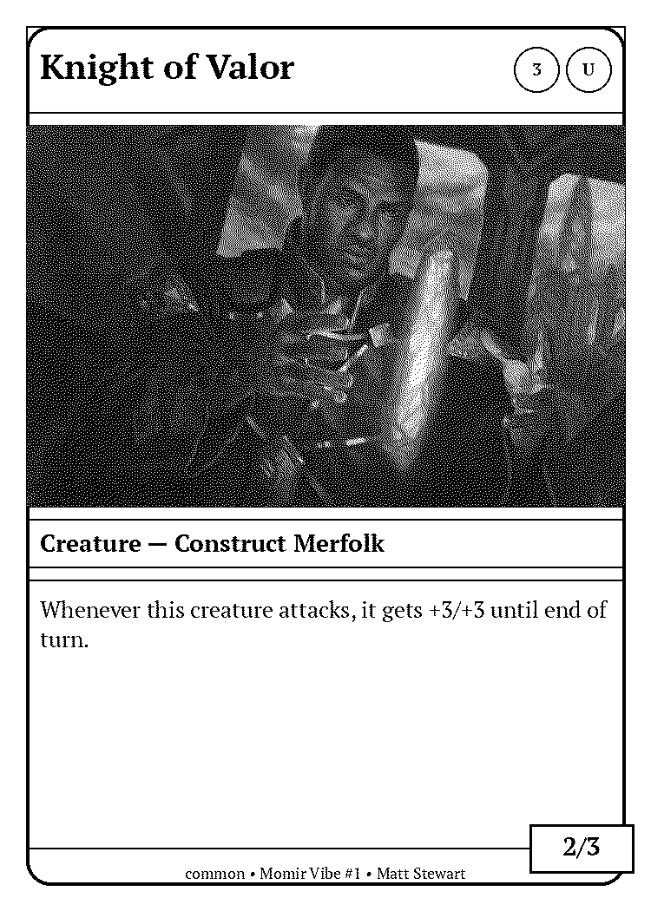

# Momir Vibe

A vibe-coded Magic: The Gathering creature card generator, built for Momir-style play. Give it a mana value, get back a randomly-generated, fully-statted creature card that doesn't exist.

## Screenshots

<p>
  
  
  
</p>

Three cards generated at different mana values from the mockup page in `static/` — real art, on-curve stats, and generated rules text, none of it copied from any single real card.

There's also a printable version — a black & white, card-shaped PNG meant for a thermal printer, for "printer" Momir Vig setups that pull a random card *image* rather than JSON:

<p>
  
</p>

## How it works

Every part of a card — name, mana cost, type line, power/toughness, keywords, rules text, art — is sampled from the real distribution of creatures at the requested mana value, rather than synthesized from hardcoded rules. That's where the "on curve" feel comes from. Each piece has its own module with the actual mechanism documented at the top of the file:

| Piece | Module |
|---|---|
| Names (word-level Markov for ordinary creatures, character-level for legendary) | `momir/names.py` |
| Rules text + keywords (sampled real sentences, recombined only at real grammatical seams) | `momir/text.py` |
| Mana cost | `momir/colors.py` |
| Power/toughness | `momir/stats.py` |
| Type line | `momir/types.py` |
| Art (a real creature's art crop, matched by color identity) | `momir/art.py` |
| Printable B&W card image | `momir/render.py` |

**Mayhem mode** breaks the mana-value scoping on purpose, for off-curve cards: `off` (default, normal generation), `text` (keywords/rules text pooled from every mana value), `full` (mana cost/type/stats pooled too, though mana value itself is unchanged). Exact weighting lives in `momir/card_builder.py`'s `Mayhem` type and `momir/corpus.py`'s `mana_value_weight`.

## Setup

```bash
python3 -m venv .venv
source .venv/bin/activate
pip install -r requirements.txt

# One-time (or occasional) fetch of real creature card data to train on.
# Writes data/cards_cache.json (~6-7 MB), gitignored.
python -m data.fetch_cards
python -m data.fetch_cards --set woe  # or just top up one set by name, instead of a full refetch
```

The Scryfall fetch above is the only network access the *server* itself ever makes — generation and the API run fully offline against the cached JSON. The one exception: `art_url`/the printable-image endpoint pull real art from Scryfall's CDN (the browser's job for the JSON endpoint's `art_url`, the server's job — with a timeout and a placeholder fallback — for the image endpoint).

## Run the API

```bash
python -m momir.main
```

Serves at `http://127.0.0.1:8000` — a card mockup page in the browser, interactive docs at `/docs`.

- `GET /cards/generate?mana_value=4` — one generated creature card (mana value 0–16) as JSON.
- `GET /cards/generate/image?mana_value=4` — the same, as a black & white printable PNG.
- `GET /health` — liveness + corpus size.

Both generation endpoints take an optional `format` (`standard`/`pioneer`/`modern`, restricts training data to that format's legal pool) and `mayhem` (see above). Full param docs are in `/docs`.

```bash
curl "http://127.0.0.1:8000/cards/generate?mana_value=3"
```

```json
{
  "name": "Treetop Freedom Fighters",
  "mana_cost": "{3}",
  "mana_value": 3,
  "type_line": "Creature — Human Druid",
  "power": 2,
  "toughness": 3,
  "keywords": ["Indestructible"],
  "rules_text": ["When this creature enters, put a +1/+1 counter on target creature."],
  "artist": "Some Real Artist",
  "art_url": "https://cards.scryfall.io/art_crop/front/....jpg"
}
```

## Project layout

```
data/fetch_cards.py    one-time Scryfall fetch -> data/cards_cache.json
momir/corpus.py         loads the cache, builds training indices
momir/markov.py         the generic Markov chain implementations
momir/card_builder.py   ties every piece above into a Card
momir/models.py         pydantic Card schema + request/response shapes
momir/api.py            FastAPI app + routes
momir/main.py           uvicorn entrypoint
static/                 card mockup web page (vanilla HTML/CSS/JS, no build step)
```

(names/text/colors/stats/types/art/render are listed in the table above.)

## Notes / limitations

- Generated rules text is flavorful, not mechanically enforced — this is a card *generator*, not a game engine.
- A Standard-scoped corpus (`format=standard`) goes stale as sets rotate; re-run `data/fetch_cards` occasionally if you use it. Modern/Pioneer don't have this problem.
- A `data/cards_cache.json` fetched before art support existed has no art data; cards fall back to a plain placeholder until you re-run the fetch.
